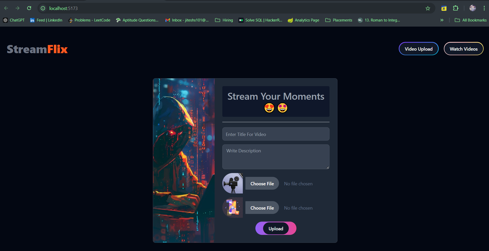
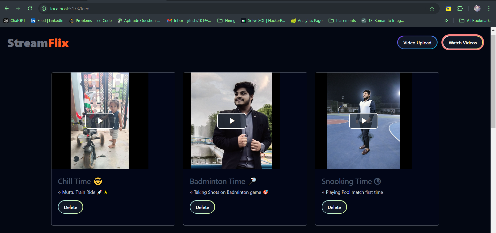

# :: StreamFlix React UI :: 

- [Live Preview](https://stream-flix-ui.vercel.app/)
- [CodeTime](https://wakatime.com/@Er_Jrsingh/projects/foasnqbnot)
  
### Tech Stacks - 

- React + Vite
- Tailwind CSS
- Flowbite
- Axios
- React-Toastify
- Video.js, Hls.js
- Cookie Management
- FFmpeg for Transcoding
- Byte range for buffering optimazation
- Java, JavaScript, Spring Boot, MySql, API 

> ### Snaps -

> > 

> >
